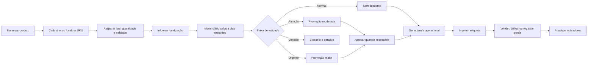
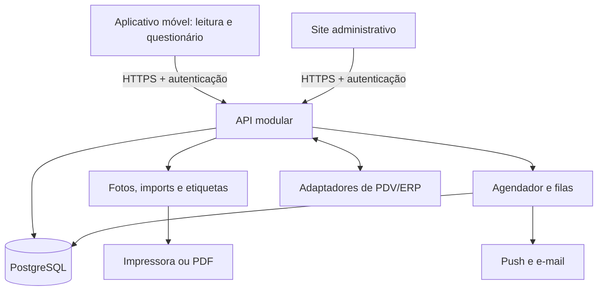

# PRD — Sistema de Controle de Validade e Promoções Automáticas

**Nome provisório:** ValidaGiro  
**Versão:** 0.1  
**Data:** 06/08/2026  
**Status:** Escopo inicial definido — aplicativo de leitura e questionário integrado ao site  
**Origem:** Ideia apresentada em fluxo visual de cadastro, localização, controle de validade, classificação por cores, promoção automática, impressão de etiqueta e acompanhamento de resultados.

---

## 1. Resumo executivo

O ValidaGiro é um sistema para reduzir perdas de produtos perecíveis ou com prazo de validade em mercados, farmácias, lojas de conveniência, depósitos e operações semelhantes.

A solução registra cada produto e seus respectivos **lotes**, acompanha diariamente o tempo restante até o vencimento, classifica o risco por cores, sugere ou aplica descontos conforme regras configuráveis, gera etiquetas promocionais e mede o resultado das ações.

O principal diferencial não é apenas alertar que um item vai vencer. O produto fecha o ciclo operacional:

1. identifica o item;
2. informa onde ele está armazenado;
3. acompanha a validade por lote;
4. determina a urgência;
5. cria uma ação promocional;
6. gera a etiqueta correta;
7. registra venda, baixa ou perda para medir o resultado.

### Recomendação de produto

Começar por um **aplicativo móvel de coleta**, destinado a uma unidade piloto. O funcionário escaneia o código de barras, identifica ou cadastra o produto, responde um questionário guiado e envia os dados para uma API central. O site administrativo consulta a mesma API e o mesmo banco de dados para acompanhar produtos, lotes, validades e pendências.

A primeira versão recomendada é um aplicativo em React Native com Expo, inicialmente otimizado para Android, um site em Next.js e uma API modular em NestJS ligada ao PostgreSQL. A arquitetura deve nascer preparada para várias lojas, mas o MVP não deve começar com microserviços nem exigir integração profunda com o PDV.

---

## 2. Problema

Operações varejistas perdem produtos porque o controle de validade costuma depender de planilhas, inspeções manuais, memória dos funcionários ou alertas que não geram uma ação concreta.

Os principais problemas são:

- itens próximos do vencimento não são identificados a tempo;
- o mesmo produto pode existir em vários lotes com datas diferentes;
- não há priorização clara do que deve ser tratado primeiro;
- descontos são definidos de forma inconsistente;
- etiquetas são produzidas manualmente e podem conter erros;
- o produto mais novo pode ser vendido antes do mais antigo;
- vendas, perdas e descontos não são relacionados à validade do lote;
- a gestão não consegue medir quanto deixou de perder.

---

## 3. Visão do produto

Permitir que qualquer loja saiba, diariamente, **quais lotes estão próximos do vencimento, onde estão, qual ação deve ser tomada e qual foi o resultado financeiro dessa ação**.

### Proposta de valor

- Menos perdas por vencimento.
- Maior giro de estoque.
- Rotina operacional simples e priorizada.
- Padronização das promoções.
- Rastreabilidade das alterações e decisões.
- Visibilidade gerencial sobre estoque em risco, descontos e perdas evitadas.

---

## 4. Objetivos

### 4.1 Objetivos de negócio

- Reduzir o valor de produtos descartados por vencimento.
- Aumentar a proporção de lotes vendidos antes da validade.
- Reduzir o tempo gasto em conferências manuais.
- Criar uma política de descontos consistente e auditável.
- Melhorar a rotação FEFO: primeiro que vence, primeiro que sai.

### 4.2 Objetivos do MVP

- Ler códigos de barras pela câmera do celular ou por leitor externo.
- Apresentar um questionário de produto e lote após a leitura.
- Preencher automaticamente dados já conhecidos para evitar trabalho repetido.
- Enviar as respostas para uma API compartilhada com o site.
- Exibir no site os dados coletados pelo aplicativo.
- Registrar lotes, quantidade, validade e localização.
- Recalcular diariamente os dias restantes de cada lote.
- Classificar os lotes em estados visuais configuráveis.
- Gerar promoções automaticamente ou mediante aprovação.
- Gerar e imprimir etiquetas promocionais.
- Exibir uma lista diária de ações prioritárias.
- Registrar vendas, baixas, ajustes e perdas, mesmo que inicialmente por operação manual ou importação de arquivo.
- Disponibilizar indicadores básicos de perdas, estoque em risco e giro promocional.

### 4.3 Fora do escopo inicial

- Substituir um ERP, WMS ou PDV completo.
- Fazer previsão de demanda com inteligência artificial.
- Alterar preços no PDV sem homologação da integração.
- Automatizar compras e reposição.
- Controlar temperatura, cadeia fria ou qualidade física do produto.
- Criar um marketplace de produtos próximos do vencimento.
- Implantar arquitetura de microserviços no MVP.

---

## 5. Premissas adotadas

- A primeira implantação será feita em uma empresa e uma unidade piloto.
- O primeiro dispositivo-alvo será Android; suporte a iOS poderá usar a mesma base React Native após homologação.
- O modelo de dados será preparado para múltiplas empresas e lojas.
- Os descontos de 0%, 10% e 20% apresentados na ideia são valores iniciais, não regras fixas do sistema.
- Cada empresa poderá configurar faixas, percentuais, categorias elegíveis, preço mínimo e necessidade de aprovação.
- O estoque será controlado por **produto + lote + validade + localização**.
- O aplicativo e o site não acessarão o banco diretamente com credenciais administrativas; ambos usarão uma API autenticada.
- O questionário inicial terá estrutura definida pelo produto. Um construtor de formulários totalmente dinâmico ficará para uma fase posterior.
- O fuso horário será configurado por loja; a virada diária não deve depender do relógio do dispositivo do funcionário.
- A integração com PDV será feita por adaptadores. No piloto, poderá ser substituída por importação CSV ou baixa manual controlada.
- A impressão inicial poderá usar PDF em impressora comum ou térmica. Integração direta com modelos específicos será homologada separadamente.

---

## 6. Usuários e perfis

### 6.1 Operador de estoque

Responsável por cadastrar lotes, conferir datas, localizar mercadorias, imprimir etiquetas e executar tarefas diárias.

**Necessidade principal:** saber rapidamente o que conferir ou etiquetar, sem interpretar uma planilha extensa.

### 6.2 Gerente da loja

Configura limites operacionais, aprova descontos excepcionais e acompanha perdas, cobertura de validade e execução da equipe.

**Necessidade principal:** visualizar risco e tomar decisões comerciais com controle.

### 6.3 Administrador da empresa

Gerencia lojas, usuários, permissões, categorias, integrações e políticas globais.

**Necessidade principal:** padronizar o processo e preservar a rastreabilidade.

### 6.4 Caixa ou atendente

Consulta ou aplica a promoção correta no momento da venda, dependendo da integração disponível.

**Necessidade principal:** identificar o item promocional sem escolher manualmente o lote errado.

### 6.5 Analista ou proprietário

Acompanha indicadores financeiros e operacionais.

**Necessidade principal:** saber se as promoções reduziram perdas e se foram economicamente vantajosas.

---

## 7. Jornada principal

### 7.1 Fluxo prioritário do primeiro aplicativo

1. O operador entra no aplicativo com sua conta.
2. O aplicativo identifica a empresa e a loja autorizadas.
3. O operador toca em **Ler código de barras**.
4. A câmera reconhece EAN-8, EAN-13, UPC-A, UPC-E ou outro formato habilitado.
5. O aplicativo consulta o código na API.
6. Se o produto já existir, seus dados permanentes aparecem preenchidos.
7. Se o produto não existir, o aplicativo abre o cadastro inicial.
8. O operador responde às perguntas do lote: validade, quantidade, localização e número do lote, quando houver.
9. O aplicativo valida as respostas e mostra um resumo antes do envio.
10. A API grava produto, lote, respostas e auditoria em uma única transação lógica.
11. O aplicativo mostra **Cadastro enviado com sucesso** e permite ler o próximo item.
12. O site administrativo passa a exibir o registro e sua situação de validade.

### 7.2 Estrutura do questionário

O questionário deve ser curto e contextual. O aplicativo não deve perguntar novamente informações permanentes quando o produto já estiver cadastrado.

#### Perguntas do produto

Respondidas no primeiro cadastro e editáveis por usuários autorizados:

- O código lido está correto?
- Qual é o nome do produto?
- Qual é a marca?
- Qual é a categoria?
- Qual é a unidade de medida?
- Qual é o conteúdo ou peso da embalagem?
- Qual é o preço de venda atual?
- O produto pode receber promoção automática?
- Deseja adicionar uma foto? Opcional no MVP.

#### Perguntas do lote

Respondidas a cada nova entrada ou contagem:

- Qual é a data de validade?
- Qual é o número do lote? Opcional quando não estiver disponível.
- Quantas unidades estão sendo registradas?
- Onde o produto está armazenado?
- Qual é a data de entrada? Preenchida automaticamente, mas editável com permissão.
- Qual é o custo unitário? Opcional.
- Existe alguma observação, avaria ou restrição?

#### Comportamento do formulário

- Indicar perguntas obrigatórias e explicar erros junto ao campo.
- Abrir seletor de data em vez de exigir digitação livre.
- Permitir escolher uma localização previamente cadastrada.
- Oferecer confirmação visual do código e do produto antes de salvar.
- Salvar rascunho local se houver interrupção durante o preenchimento.
- Evitar envio duplicado ao tocar mais de uma vez no botão.
- Mostrar o estado de sincronização: rascunho, enviando, enviado ou com erro.
- Registrar a versão do questionário usada em cada resposta.

---

## 8. Escopo funcional do MVP

### RF-00 — Aplicativo móvel de leitura e coleta

O sistema deve possuir um aplicativo móvel autenticado para leitura de código de barras e preenchimento do questionário de produto/lote.

**Critérios de aceite:**

- A câmera deve reconhecer os formatos homologados em condições normais de iluminação.
- O operador também deve poder digitar o código quando a leitura falhar.
- Após a leitura, a consulta do produto deve ocorrer pela API central.
- Produto existente deve abrir com seus dados permanentes preenchidos.
- Produto inexistente deve abrir o questionário completo.
- O envio deve criar ou atualizar o produto e registrar o lote sem duplicidade.
- Uma falha de rede não pode apagar um formulário já preenchido.
- O aplicativo deve informar claramente se o registro ainda não foi sincronizado.
- O site deve receber o novo registro sem exigir nova digitação.

### RF-01 — Cadastro de produtos

O sistema deve permitir cadastrar ou localizar um produto pelo código de barras.

**Campos mínimos:**

- GTIN/EAN/UPC ou código interno;
- nome;
- categoria;
- unidade de medida;
- preço de venda atual;
- status ativo/inativo;
- elegibilidade para promoção;
- percentual máximo de desconto, quando aplicável.

**Critérios de aceite:**

- Um código de barras não pode identificar dois produtos ativos dentro da mesma empresa.
- O operador pode corrigir dados conforme sua permissão.
- O cadastro mantém histórico de alterações relevantes.

### RF-02 — Cadastro de lotes e validade

O sistema deve permitir vários lotes para o mesmo produto.

**Campos mínimos:**

- produto;
- número do lote, quando disponível;
- data de validade;
- quantidade recebida e quantidade atual;
- loja;
- localização;
- data de entrada;
- fornecedor opcional;
- custo unitário opcional;
- observação.

**Critérios de aceite:**

- Dois lotes do mesmo produto podem ter validades e locais diferentes.
- Não é permitido registrar quantidade negativa.
- Alterações de quantidade geram movimento de estoque e auditoria.
- O sistema alerta sobre data de validade anterior à data de entrada, sem permitir o salvamento sem confirmação autorizada.

### RF-03 — Localização física

O sistema deve organizar locais em uma hierarquia simples:

`Loja > área > corredor > seção/prateleira`.

O operador deve conseguir consultar todos os lotes de uma localização e mover um lote entre locais, registrando responsável, data e quantidade.

### RF-04 — Classificação por validade

O motor deve calcular o estado de cada lote pela diferença entre a data local da loja e a data de validade.

Configuração inicial sugerida:

| Estado | Dias restantes | Cor | Ação padrão |
|---|---:|---|---|
| Normal | 31 dias ou mais | Verde | Sem desconto |
| Atenção | 15 a 30 dias | Amarelo | 10% de desconto |
| Urgente | 1 a 14 dias | Vermelho | 20% de desconto |
| Vence hoje | 0 dia | Vermelho crítico | Regra específica e aprovação |
| Vencido | Menor que 0 | Cinza/preto | Bloquear venda e gerar tratativa |

As faixas devem ser configuráveis por empresa, loja, categoria ou produto. A regra mais específica prevalece sobre a regra mais geral.

### RF-05 — Motor de promoções

O sistema deve criar uma sugestão de promoção quando um lote entra em uma faixa configurada.

Uma regra de promoção poderá conter:

- faixa de dias;
- percentual ou preço promocional;
- categorias e produtos incluídos ou excluídos;
- loja;
- valor mínimo de margem ou preço mínimo;
- período de vigência;
- necessidade de aprovação;
- limite máximo de desconto por perfil;
- ação no vencimento.

**Critérios de aceite:**

- A promoção deve ser idempotente: o processamento diário não pode criar promoções duplicadas para o mesmo lote e regra.
- Toda promoção deve registrar a regra, o preço original, o desconto, o preço final, o responsável e os horários de criação/aprovação.
- Mudanças na regra não devem apagar o histórico de promoções antigas.
- Promoções abaixo do piso configurado devem exigir aprovação ou ser bloqueadas.

### RF-06 — Aprovação de exceções

Quando configurado, o gerente poderá aprovar, rejeitar ou ajustar uma promoção dentro dos limites de sua permissão.

O sistema deve informar claramente:

- quantidade afetada;
- validade;
- preço original e promocional;
- margem estimada, se houver custo disponível;
- regra que originou a sugestão;
- impacto estimado.

### RF-07 — Etiquetas promocionais

O sistema deve gerar uma etiqueta com:

- nome resumido do produto;
- percentual e/ou preço promocional;
- preço anterior, quando exigido pela política comercial;
- validade da promoção;
- identificador interno da promoção;
- código de barras ou QR interno;
- lote ou informação rastreável;
- data e hora de impressão.

Deve ser possível reimprimir, cancelar e consultar o histórico. A impressão deve registrar quantidade de etiquetas e usuário.

### RF-08 — Lista diária de tarefas

O sistema deve apresentar uma fila priorizada com ações como:

- conferir validade;
- mover produto para área promocional;
- aprovar desconto;
- imprimir ou reimprimir etiqueta;
- recolher item vencido;
- investigar divergência de estoque;
- revisar promoção sem venda.

A prioridade deve considerar dias restantes, valor em risco, quantidade e status da tarefa.

### RF-09 — Movimentos e resultado

O sistema deve registrar:

- entrada;
- transferência;
- ajuste positivo ou negativo;
- venda;
- descarte por vencimento;
- avaria;
- devolução;
- cancelamento de promoção.

O resultado de venda poderá entrar por integração de PDV, arquivo CSV ou operação manual durante o piloto.

### RF-10 — Painel gerencial

O painel do MVP deve exibir:

- valor e quantidade de estoque por faixa de validade;
- produtos que vencem nos próximos 7, 15 e 30 dias;
- valor vendido com desconto;
- valor descartado por vencimento;
- taxa de venda antes do vencimento;
- promoções criadas, aprovadas, aplicadas e sem resultado;
- tarefas pendentes e atrasadas;
- cobertura de lotes com validade registrada;
- ranking de categorias e produtos com maior perda.

### RF-11 — Usuários, papéis e auditoria

Papéis iniciais:

- operador;
- gerente;
- administrador da empresa;
- auditor/leitura.

Eventos sensíveis — alteração de validade, quantidade, preço, regra, promoção, permissão ou baixa — devem registrar quem fez, quando fez, valor anterior, valor novo e contexto.

### RF-12 — Importação e exportação

O MVP deve permitir:

- importar catálogo, lotes e vendas por CSV padronizado;
- validar o arquivo antes da confirmação;
- apresentar erros por linha;
- evitar duplicidade por chave de importação;
- exportar relatórios em CSV;
- baixar etiquetas em PDF.

---

## 9. Regra crítica: produto não é lote

Um código EAN/UPC comum costuma identificar o SKU, não uma unidade ou lote específico. Assim, duas caixas do mesmo produto podem ter o mesmo código e datas de validade diferentes.

Por isso, o sistema não pode aplicar desconto apenas ao cadastro geral do produto sem considerar o lote. Para o MVP, há três estratégias:

1. **Etiqueta promocional interna por lote:** gerar um código adicional que identifica a promoção e o lote. É a opção recomendada para o piloto.
2. **Promoção por SKU no PDV:** usar apenas quando todo o estoque vendável daquele SKU estiver sob a mesma promoção ou quando houver controle operacional que impeça mistura.
3. **Integração avançada com lote:** utilizar quando o ERP/PDV aceitar lote na venda ou quando o produto usar padrões capazes de carregar lote e validade.

Os padrões GS1 permitem que alguns códigos, como GS1-128, GS1 DataMatrix e GS1 QR, transportem GTIN e atributos como lote e validade. Entretanto, isso depende da embalagem, do leitor e dos sistemas da operação. O produto deve tratar essa capacidade como integração opcional, e não como premissa universal.

---

## 10. Regras de negócio

### RN-01 — Cálculo de dias restantes

`dias_restantes = data_de_validade - data_local_da_loja`

- O cálculo usa datas civis, não blocos móveis de 24 horas.
- A classificação deve ser reprocessada diariamente e após alteração de validade ou regra.
- O fuso horário da loja deve ser persistido.

### RN-02 — Precedência de regras

Da mais específica para a mais geral:

1. produto na loja;
2. categoria na loja;
3. regra da loja;
4. produto na empresa;
5. categoria na empresa;
6. regra padrão da empresa.

Empates devem ser impedidos na configuração ou resolvidos por prioridade explícita.

### RN-03 — Estoque vencido

- Lotes vencidos não podem receber promoção ativa.
- O sistema deve marcá-los como bloqueados e criar tarefa de recolhimento.
- A baixa deve exigir motivo e, conforme permissão, confirmação do gerente.

### RN-04 — FEFO

Em consultas e tarefas operacionais, o lote com menor validade deve aparecer primeiro. O sistema deve alertar quando um lote mais novo estiver exposto ou sendo movimentado antes do lote mais antigo.

### RN-05 — Consistência de preços

- O preço final nunca pode ser negativo.
- O arredondamento deve seguir regra financeira configurada e ser armazenado com precisão decimal.
- O desconto exibido, o preço impresso e o preço enviado ao PDV devem ser idênticos.
- Uma mudança de preço-base deve reavaliar promoções ainda não iniciadas e sinalizar promoções ativas divergentes.

### RN-06 — Rastreabilidade

Registros financeiros, de estoque e de auditoria não devem ser apagados fisicamente pela interface. Cancelamentos devem gerar novos eventos compensatórios.

### RN-07 — Concorrência

Movimentações simultâneas não podem resultar em estoque negativo. Atualizações de quantidade devem usar transações e controle de concorrência.

---

## 11. Requisitos não funcionais

### Desempenho

- 95% das consultas comuns devem responder em até 2 segundos em conexão estável.
- Leitura e retorno de um código cadastrado devem ocorrer em até 1 segundo, desconsiderando a câmera.
- Geração de uma etiqueta individual deve levar até 5 segundos.
- Processamentos em lote devem ocorrer em segundo plano.

### Disponibilidade e recuperação

- Meta inicial de disponibilidade: 99,5% ao mês, excluídas manutenções programadas.
- Backups automáticos e teste periódico de restauração.
- Operações críticas devem ser idempotentes e tolerar repetição de requisições.

### Segurança

- HTTPS obrigatório.
- Controle de acesso por empresa, loja e papel.
- Políticas de menor privilégio.
- MFA recomendado para administradores e gerentes.
- Senhas nunca armazenadas em texto puro.
- Segredos fora do código-fonte.
- Logs sem dados sensíveis desnecessários.
- Auditoria de ações críticas.
- Proteção contra abuso de login, importação e APIs.

### Privacidade

O sistema deve coletar apenas os dados pessoais necessários para autenticação, autorização, auditoria e suporte. Deve possuir política de retenção, processo de exclusão ou anonimização quando aplicável e controles coerentes com a LGPD e com as orientações de segurança da ANPD.

### Acessibilidade e usabilidade

- Interface compatível com teclado e leitores de tela nas operações principais.
- Cores nunca devem ser o único indicador de status; usar também texto e ícone.
- Ações de risco devem exigir confirmação clara.
- Uso confortável em celular, coletor, tablet e desktop.

### Observabilidade

- Logs estruturados com identificador de correlação.
- Métricas de erros, latência, filas, importações e jobs diários.
- Alertas para falha no reprocessamento, integração, backup e impressão.

---

## 12. Modelo de dados conceitual

| Entidade | Responsabilidade |
|---|---|
| Empresa | Isolamento do cliente e configurações globais |
| Loja | Fuso, política local e contexto operacional |
| Usuário | Identidade de acesso |
| Papel/Permissão | Autorização por função e escopo |
| Versão de questionário | Define perguntas, tipos, obrigatoriedade e vigência |
| Envio de coleta | Agrupa código lido, respostas, dispositivo e estado da sincronização |
| Resposta | Preserva o valor respondido e a versão da pergunta |
| Produto | Cadastro do SKU e código comercial |
| Categoria | Agrupamento e herança de regras |
| Lote | Validade, quantidade e rastreabilidade |
| Localização | Endereço físico dentro da loja |
| Movimento de estoque | Livro de entradas, saídas e ajustes |
| Regra de validade | Faixa de dias e estado visual |
| Regra de promoção | Desconto, limites e aprovação |
| Promoção | Instância aplicada a um lote |
| Etiqueta | Artefato impresso e identificador de venda |
| Tarefa | Ação operacional pendente ou concluída |
| Venda/baixa | Resultado relacionado ao lote/promoção |
| Importação | Arquivo, status, erros e idempotência |
| Dispositivo/sincronização | Controla cliente, requisições únicas e último resultado |
| Auditoria | Histórico imutável de ações sensíveis |

### Restrições essenciais

- Todas as entidades operacionais devem possuir `empresa_id`.
- Registros de loja devem validar que pertencem à mesma empresa.
- Valores monetários devem usar tipo decimal, nunca ponto flutuante.
- Quantidades devem respeitar a unidade de medida do produto.
- Uma promoção ativa deve referenciar um lote válido e uma versão de regra.
- Movimentos de estoque devem compor um livro auditável; o saldo materializado deve ser reconciliável.

---

## 13. Integrações

### 13.1 PDV/ERP

Contrato mínimo desejado:

- importar produtos e preços;
- importar recebimentos e lotes, quando disponíveis;
- publicar promoções;
- receber vendas, cancelamentos e devoluções;
- reconciliar divergências.

Cada conector deve guardar o identificador externo, horário da sincronização, versão do payload, resultado e erros. Requisições repetidas não podem duplicar vendas ou movimentos.

### 13.2 Leitores de código

- Aplicativo: câmera do celular ou tablet por meio do Expo Camera.
- Site: leitor USB/Bluetooth que funciona como teclado.
- Site: câmera com ZXing como alternativa.
- Coletor Android dedicado, em uma fase posterior.

No site, a API web `BarcodeDetector` pode ser usada como melhoria progressiva, mas não como única estratégia, pois sua disponibilidade entre navegadores ainda é limitada. Uma biblioteca compatível, como ZXing, ou leitor físico deve existir como alternativa. No aplicativo, a leitura deve usar o módulo nativo homologado e permitir digitação manual como contingência.

### 13.3 Impressoras

- MVP: etiquetas em PDF com tamanhos configuráveis.
- Impressora térmica: envio por diálogo do sistema ou ferramenta homologada.
- Fase posterior: ZPL/EPL ou SDK do fabricante para impressão direta.

Antes da implantação, devem ser homologados modelo, DPI, dimensões da etiqueta, margens, legibilidade e leitura do código impresso.

### 13.4 Notificações

- avisos dentro do sistema;
- push web para tarefas críticas;
- e-mail para resumos e falhas;
- WhatsApp apenas em fase posterior, com consentimento, templates e controle de custo.

---

## 14. Arquitetura recomendada

### Diretriz arquitetural

Usar um **monólito modular** no MVP, separando internamente os módulos de identidade, questionários, catálogo, lotes, estoque, regras, promoções, etiquetas, tarefas, integrações, relatórios e auditoria.

O aplicativo e o site são clientes diferentes da mesma API. A API é a responsável por validar permissões e regras de negócio e por acessar o banco. Essa divisão impede que as regras fiquem duplicadas entre o aplicativo e o site.

### 14.1 Contrato inicial da API

Endpoints conceituais:

- `POST /auth/session` — autenticar o usuário;
- `GET /products/by-barcode/{code}` — consultar produto pelo código;
- `POST /products` — cadastrar um produto;
- `PATCH /products/{id}` — corrigir dados permitidos;
- `GET /questionnaires/product-intake/current` — obter a versão atual do questionário;
- `POST /product-intake-submissions` — enviar produto, lote e respostas;
- `GET /locations` — listar localizações autorizadas;
- `GET /sync/submissions/{clientRequestId}` — consultar o resultado de uma tentativa;
- `GET /batches` — consultar lotes no site;
- `GET /dashboard/expiry` — alimentar o painel de validade.

Cada envio do aplicativo deve possuir um `clientRequestId` único. Se a mesma requisição for repetida por falha de rede, a API devolve o resultado anterior em vez de criar outro lote.

Essa abordagem reduz custo e complexidade operacional, preservando limites claros para uma futura extração de serviços caso volume ou integrações justifiquem.

---

## 15. Tecnologias possíveis

### 15.1 Stack recomendada para o MVP

| Camada | Tecnologia | Motivo |
|---|---|---|
| Aplicativo móvel | React Native + Expo + TypeScript | Acesso consistente à câmera, distribuição Android/iOS e evolução para recursos offline |
| Leitura no aplicativo | Expo Camera ou VisionCamera + biblioteca compatível com os códigos homologados | Controle da câmera e retorno estruturado do código lido |
| Formulários no aplicativo | React Hook Form + Zod | Validação local tipada e mensagens de erro consistentes |
| Armazenamento local | Expo SQLite para rascunhos e fila de sincronização | Evita perda do questionário em interrupções ou falhas temporárias de rede |
| Site administrativo | Next.js + React + TypeScript | Painéis, cadastros, relatórios e operação em desktop/tablet |
| Interface do site | Tailwind CSS + biblioteca acessível como shadcn/ui ou React Aria | Velocidade de desenvolvimento com componentes consistentes e responsivos |
| Backend | NestJS + TypeScript | Estrutura modular, validação, autenticação, tarefas agendadas e integração com filas |
| Banco | PostgreSQL | Adequado para transações, integridade, relatórios e modelo relacional de lotes/movimentos |
| Plataforma de dados no MVP | Supabase gerenciado | Acelera PostgreSQL, autenticação, armazenamento, APIs e políticas de acesso por linha |
| ORM/migrações | Prisma ou Drizzle ORM | Tipagem, migrações e acesso consistente ao banco |
| Jobs e filas | Agenda simples no início; BullMQ + Redis quando necessário | Reprocessamento diário, notificações, importações e integrações com repetição segura |
| Código de barras no site | Leitor USB/Bluetooth + ZXing; `BarcodeDetector` como melhoria | Permite leitura também no site sem depender da API experimental do navegador |
| Etiquetas | PDF via React-PDF/PDFKit; ZPL em impressoras Zebra homologadas | Permite começar de forma genérica e evoluir para impressão térmica direta |
| Autenticação | Supabase Auth no MVP | Login, JWT e integração com políticas de Row Level Security |
| Arquivos | Supabase Storage ou armazenamento compatível com S3 | Armazenamento de imports, exports e etiquetas |
| Testes | Vitest/Jest, Testing Library e Playwright | Testes unitários, de integração e fluxos reais no navegador |
| Observabilidade | Sentry + OpenTelemetry | Erros, desempenho e rastreamento de integrações |
| Entrega | Docker + GitHub Actions | Ambientes reproduzíveis e automação de testes/deploy |

### 15.2 Alternativa de menor complexidade

**Expo/React Native + Next.js + Supabase + PostgreSQL**, com funções de servidor e regras simples executadas no backend.

Indicada para validar a operação rapidamente, com equipe pequena e poucas integrações. Exige disciplina para manter regras sensíveis no servidor/banco e políticas de acesso bem testadas.

### 15.3 Alternativa para maior escala e integrações

**Expo/React Native + Next.js + NestJS + PostgreSQL + Redis/BullMQ**, hospedados separadamente.

Indicada quando houver várias lojas, importações grandes, conectores de PDV, alto volume de etiquetas ou necessidade de reprocessamentos robustos.

### 15.4 Alternativa de lançamento mais rápido

**PWA em Next.js + NestJS/Supabase**, instalável pelo navegador e compartilhando mais código com o site.

Indicada se a prioridade absoluta for colocar o piloto em uso sem publicar nas lojas de aplicativos. É menos adequada quando leitura contínua pela câmera, integração com hardware e operação offline forem requisitos centrais.

### 15.5 Alternativa mobile em Flutter

**Flutter + NestJS + PostgreSQL**, com SQLite local e sincronização.

É uma alternativa tecnicamente válida para Android/iOS e pode ser escolhida caso a equipe já tenha experiência em Dart. Não é recomendada junto com React Native no mesmo produto; deve-se escolher uma das duas tecnologias mobile.

### 15.6 Escolha recomendada

Para a primeira versão:

1. aplicativo Android/iOS em React Native com Expo e TypeScript;
2. site administrativo em Next.js;
3. NestJS como monólito modular e API compartilhada;
4. PostgreSQL gerenciado pelo Supabase;
5. Supabase Auth e Storage;
6. Expo SQLite para preservar rascunhos e envios pendentes no aparelho;
7. jobs agendados no início, com BullMQ/Redis quando o volume exigir;
8. leitura pela câmera no aplicativo e suporte a leitor físico no site;
9. etiquetas PDF no piloto e integração térmica homologada depois;
10. importação CSV antes de conectores específicos de PDV.

---

## 16. Métricas de sucesso

Os valores abaixo são metas iniciais a validar com a linha de base do piloto.

### Indicador principal

**Valor de perdas por vencimento por mês**, comparado à média dos três meses anteriores à implantação.

### Indicadores complementares

- Taxa de leitura de código concluída sem digitação manual.
- Tempo mediano entre leitura do código e envio do questionário.
- Taxa de abandono do questionário por pergunta.
- Percentual de envios sincronizados sem repetição manual.
- Percentual de lotes ativos com validade cadastrada.
- Percentual do estoque em risco tratado dentro do prazo.
- Taxa de venda dos lotes promovidos antes do vencimento.
- Valor recuperado por vendas promocionais.
- Valor concedido em desconto.
- Margem preservada nas promoções.
- Quantidade e valor descartados por vencimento.
- Tempo médio entre entrada na faixa e execução da tarefa.
- Divergência entre estoque do sistema e contagem física.
- Taxa de leitura correta das etiquetas no caixa.
- Percentual de jobs e integrações concluídos sem intervenção.

### Metas sugeridas para o piloto

- Pelo menos 95% dos lotes elegíveis com validade registrada.
- Pelo menos 90% das tarefas urgentes tratadas no mesmo dia.
- Pelo menos 99% das etiquetas testadas lidas corretamente.
- Redução de 20% a 30% no valor perdido por vencimento após estabilização, condicionada ao perfil da loja e à qualidade da linha de base.

---

## 17. Eventos de analytics

- `product_scanned`
- `barcode_scan_failed`
- `questionnaire_started`
- `questionnaire_saved_as_draft`
- `questionnaire_submitted`
- `questionnaire_sync_failed`
- `product_created`
- `batch_created`
- `expiry_changed`
- `batch_status_changed`
- `promotion_suggested`
- `promotion_approved`
- `promotion_rejected`
- `label_generated`
- `label_printed`
- `task_completed`
- `sale_imported`
- `batch_sold_out`
- `batch_discarded`
- `integration_failed`
- `import_failed`

Cada evento deve conter empresa, loja, usuário ou origem de sistema, horário, entidade relacionada e versão do fluxo, evitando dados pessoais desnecessários.

---

## 18. Critérios de aceite do MVP

O MVP será considerado pronto para piloto quando:

1. Um operador conseguir entrar no aplicativo e ler um código com a câmera.
2. Um produto conhecido abrir com as respostas permanentes já preenchidas.
3. Um produto desconhecido abrir o questionário completo.
4. O operador conseguir cadastrar o produto e criar dois lotes com validades diferentes.
5. O envio aparecer no site sem nova digitação.
6. Uma interrupção de rede não apagar o formulário preenchido.
7. Repetir o mesmo envio não criar produto ou lote duplicado.
8. Cada lote puder ser associado a uma localização e movimentado com histórico.
9. O motor diário classificar corretamente lotes normais, em atenção, urgentes, vencendo hoje e vencidos.
10. Uma regra configurável gerar promoção sem duplicidade.
11. Um gerente conseguir aprovar uma exceção com trilha de auditoria.
12. O sistema gerar uma etiqueta legível e rastreável para o lote correto.
13. A baixa por venda, ajuste ou descarte atualizar o saldo sem permitir quantidade negativa.
14. O painel refletir estoque em risco, vendas promocionais e perdas.
15. Usuários não conseguirem acessar lojas ou ações fora de sua permissão.
16. Importações repetidas não duplicarem dados.
17. Falhas do job diário ou de integração gerarem alerta operacional.
18. Backups e restauração tiverem sido testados antes do uso em produção.

---

## 19. Roadmap sugerido

### Fase 0 — Descoberta e piloto operacional

- Mapear recebimento, exposição, remarcação, caixa e descarte.
- Identificar modelos de leitores, impressoras, etiquetas, ERP e PDV.
- Medir a linha de base de perdas.
- Validar regras por categoria e limites comerciais.
- Definir se a promoção será identificada por etiqueta interna ou integrada ao PDV.

### Fase 1 — MVP

- Aplicativo React Native/Expo para Android.
- Login, câmera e leitura de códigos homologados.
- Questionário guiado de produto e lote.
- Rascunho local e sincronização segura.
- API central e autenticação/permissões.
- Site administrativo com consulta dos registros enviados.
- Produtos, lotes, validade e localizações no PostgreSQL.
- Classificação por cores e tarefas.
- Regras e promoções.
- Etiquetas em PDF.
- Movimentos manuais e CSV.
- Painel básico e auditoria.

### Fase 2 — Integrações e escala

- Conector com o PDV/ERP do piloto.
- Impressão térmica direta.
- Push e alertas gerenciais.
- Multiunidade avançado.
- Reconciliação automática.
- Regras por margem, giro e categoria.

### Fase 3 — Otimização

- Previsão de risco por demanda.
- Recomendação dinâmica de desconto.
- Sugestão de transferência entre lojas.
- Detecção de anomalias e divergências.
- Marketplace ou comunicação ao consumidor, se fizer sentido comercial.

> Prazos devem ser estimados somente após a descoberta técnica dos sistemas de PDV, impressoras e qualidade dos dados. Integrações costumam ser a maior fonte de incerteza.

---

## 20. Riscos e mitigação

| Risco | Impacto | Mitigação |
|---|---|---|
| Código comum não diferencia lote | Desconto ou baixa no lote errado | Etiqueta interna única, separação física e homologação do fluxo de caixa |
| Validade digitada incorretamente | Promoção indevida ou produto vencido em exposição | Leitura assistida, dupla confirmação para exceções e auditoria |
| Funcionário ignora tarefas | Estoque continua vencendo | Fila diária, responsáveis, atraso, alertas e indicador de execução |
| PDV não aceita promoção por lote | Preço inconsistente no caixa | Começar com etiqueta interna e conector específico após descoberta |
| Mistura de lotes na prateleira | Venda do lote mais novo primeiro | FEFO, localização, tarefa de organização e conferência física |
| Rede instável | Operação interrompida | Rascunhos locais em SQLite, fila de sincronização e estado visível de cada envio |
| Desconto destrói margem | Perda financeira | Piso de preço, custo, limite por papel e aprovação |
| Duplicidade de importações/vendas | Estoque e indicadores incorretos | Chaves idempotentes, reconciliação e logs de integração |
| Impressão ilegível | Falha no caixa | Homologação por modelo, DPI e tamanho; teste de leitura antes do piloto |
| Excesso de alertas | Usuários deixam de reagir | Priorização por risco, agrupamento e limites configuráveis |
| Acesso indevido entre lojas | Exposição ou alteração de dados | Isolamento por empresa/loja, RLS, testes de autorização e auditoria |

---

## 21. Questões em aberto

1. Qual é o segmento inicial: supermercado, farmácia, conveniência, restaurante ou outro?
2. Quantas lojas, produtos, lotes e usuários participarão do piloto?
3. Qual ERP e qual PDV são usados?
4. O PDV aceita promoções por código interno, lote ou etiqueta adicional?
5. Quais leitores e impressoras já existem nas lojas?
6. A validade é informada eletronicamente pelo fornecedor ou sempre conferida no recebimento?
7. Há produtos fracionados, pesáveis ou com preço variável?
8. Quais categorias não podem receber desconto automático?
9. Quais limites de margem, preço e aprovação são necessários?
10. O preço promocional deve ser enviado ao PDV ou apenas impresso?
11. Como vendas e devoluções serão atribuídas ao lote correto?
12. Qual é o processo atual de descarte e comprovação da perda?
13. Quais relatórios fiscais ou comerciais são exigidos?
14. A operação precisa funcionar sem internet? Por quanto tempo?
15. Qual é a linha de base de perdas por categoria e loja?
16. O primeiro aplicativo será distribuído pela Play Store, por instalação interna ou por gerenciamento corporativo?
17. Quais perguntas do questionário são obrigatórias para todas as categorias?
18. Alguma categoria precisa de perguntas próprias, como temperatura, peso ou registro sanitário?
19. Quais formatos de código e modelos de celular precisam ser homologados?

---

## 22. Decisões recomendadas antes de iniciar o desenvolvimento

- Escolher uma única loja e duas ou três categorias para o piloto.
- Definir formalmente o identificador do lote no caixa.
- Homologar pelo menos um leitor e uma impressora.
- Selecionar as faixas e descontos iniciais com o responsável comercial.
- Definir preço mínimo, margem mínima e aprovações.
- Obter exemplos reais de arquivos e APIs do ERP/PDV.
- Medir perdas por 8 a 12 semanas ou recuperar histórico confiável.
- Designar um responsável operacional pelo cadastro e pela execução diária.

---

## 23. Referências técnicas oficiais consultadas

- [React Native — início de projeto com Expo](https://reactnative.dev/docs/environment-setup): recomendação de framework para iniciar aplicações React Native com recursos nativos.
- [Expo Camera](https://docs.expo.dev/versions/latest/sdk/camera/): acesso à câmera e callback de leitura para formatos como EAN, UPC, Code 128, Data Matrix e QR.
- [Expo SQLite](https://docs.expo.dev/versions/latest/sdk/sqlite/): banco local persistente para rascunhos e fila de sincronização do aplicativo.
- [Next.js — guia oficial de Progressive Web Apps](https://nextjs.org/docs/app/guides/progressive-web-apps): suporte a manifesto, instalação, service worker e notificações web.
- [NestJS — documentação oficial](https://docs.nestjs.com/introduction): framework modular em TypeScript para aplicações de servidor.
- [NestJS — filas com BullMQ](https://docs.nestjs.com/techniques/queues): processamento persistente e distribuído de tarefas em segundo plano com Redis.
- [Supabase Auth](https://supabase.com/docs/guides/auth): autenticação com JWT e integração com Row Level Security no PostgreSQL.
- [Supabase Realtime](https://supabase.com/docs/guides/realtime): atualização de clientes e painéis a partir de eventos e mudanças no PostgreSQL.
- [PostgreSQL — documentação oficial](https://www.postgresql.org/docs/): banco relacional transacional recomendado para lotes, movimentos, regras e auditoria.
- [GS1 — padrões de códigos de barras](https://www.gs1.org/standards/barcodes): identificação de produtos e uso de atributos como lote e datas em padrões compatíveis.
- [GS1 — códigos que representam GTIN](https://support.gs1.org/support/solutions/articles/43000734104-which-barcodes-are-used-to-represent-gtins-): distinção entre códigos comuns de varejo e formatos capazes de carregar atributos adicionais.
- [MDN — Barcode Detection API](https://developer.mozilla.org/en-US/docs/Web/API/Barcode_Detection_API): API de leitura por câmera com disponibilidade limitada entre navegadores.
- [ANPD — Guia de Segurança da Informação para Agentes de Tratamento de Pequeno Porte](https://www.gov.br/anpd/pt-br/centrais-de-conteudo/materiais-educativos-e-publicacoes/guia-vf.pdf): referência para medidas de segurança relacionadas a dados pessoais.

---

## 24. Síntese da recomendação

O produto é viável e possui um caso de uso objetivo, mensurável e operacionalmente relevante. O melhor caminho é validar primeiro o controle por lote, a execução diária e a identificação correta da promoção no caixa.

A recomendação é iniciar com um aplicativo em React Native/Expo para leitura e questionário, um site administrativo em Next.js e uma API modular em NestJS ligada ao PostgreSQL gerenciado. Aplicativo e site devem compartilhar autenticação, regras e banco por meio da API. A integração profunda com PDV, impressão térmica direta e inteligência de desconto devem entrar depois que o piloto comprovar o fluxo e produzir dados confiáveis.
